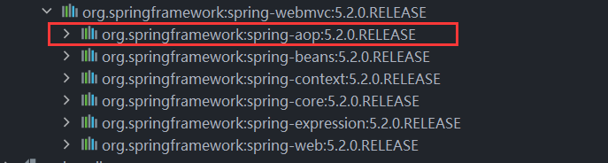
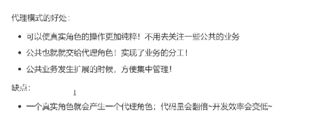

###一、常用依赖
```xml
<dependency>
    <groupId>org.springframework</groupId>
    <artifactId>spring-webmvc</artifactId>
    <version>5.2.0.RELEASE</version>
</dependency>

<dependency>
    <groupId>junit</groupId>
    <artifactId>junit</artifactId>
    <version>4.12</version>
    <scope>test</scope>
</dependency>
```

###二、spring开启注解
```xml
<context:annotation-config/>
```


###三、常用注解说明
- @Autowired: 通过byType的方式实现，而且必须要求这个对象存在！
如果Autowired不能唯一自动装配行属性，则需要通过@Qualifier(value="xxx")

- @Resource：默认通过byName方式实现，如果找不到名字，则通过byType实现，两个都找不到的情况就报错。

 上面两个注解都是用来自动装配的，都可以放在属性字段上。不同之处是执行顺序不同：@Autowired通过byType的
方式实现，@Resource通过byName方式实现。

- @Nullable：标识某个属性可为空。

- @Component: 组件，衍生注解有：@Controller, @Service, @Repository,这三个注解作用相当，底层还是@Component


###四、使用注解开发
在spring4之后，要使用注解开发，必须保证aop的包导入了。


beans.xml中需要导入context约束，增加注解的支持。
```xml
<beans xmlns="http://www.springframework.org/schema/beans"
       xmlns:xsi="http://www.w3.org/2001/XMLSchema-instance"
       xmlns:context="http://www.springframework.org/schema/context"
       xsi:schemaLocation="http://www.springframework.org/schema/beans
        http://www.springframework.org/schema/beans/spring-beans.xsd
        http://www.springframework.org/schema/context
        http://www.springframework.org/schema/context/spring-context.xsd">

    <context:annotation-config/>

</beans>
```

###五、代理模式
是SpringAOP的底层原理【重要！！！】

#### 5.1、静态代理

角色分析：
- 抽象角色：一般会使用接口或者抽象类来解决
- 真实角色：被代理的角色
- 代理角色：代理真实角色，代理真实角色后，一般会做一些附属操作
- 客户： 访问代理对象的人



静态代理缺点：一个真实角色就会产生一个代理角色；代码量会翻倍，开发效率变低。
解决这一缺点可以使用动态代理。


#### 5.2、动态代理
- 动态代理和静态代理角色一样
- 动态代理的代理类是动态生成的，不是我们直接写好的
- 动态代理分为两大类：基于接口的动态代理，基于类的动态代理


基于接口--JDK动态代理
基于类：cglib
java字节码实现

